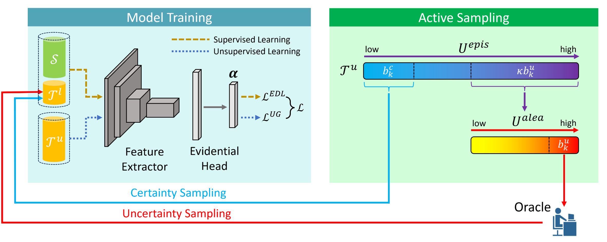

<div align="center">

  # Evidential Uncertainty Quantification</br>for Active Domain Adaptation

  

</div>


## Overview

An active domain adaptation framework based on **evidential deep learning** (EDL) implemented with
- two **sampling strategies**: uncertainty sampling and certainty sampling
- two **uncertainty quantification methods**: entropy-based and variance-based
- three **EDL loss functions**: negative log likelihood, cross-entropy, and sum-of-squares

## Paper
Official implementation of 

<b>Evidential Uncertainty Quantification: A Variance-Based Perspective</b> [WACV 2024]
<br/>
[Ruxiao Duan](https://scholar.google.com/citations?hl=en&user=aG-fi1cAAAAJ)<sup>1</sup>,
[Brian Caffo](https://scholar.google.com/citations?hl=en&user=Ff81yEQAAAAJ)<sup>1</sup>,
[Harrison X. Bai](https://scholar.google.com/citations?hl=en&user=Kh96AEArs2gC)<sup>2</sup>,
[Haris I. Sair](https://scholar.google.com/citations?hl=en&user=DcUpmR8AAAAJ)<sup>2</sup>,
[Craig Jones](https://scholar.google.com/citations?hl=en&user=uWxO67gAAAAJ)<sup>1</sup>
<br/>
<sup>1</sup>Johns Hopkins University,
<sup>2</sup>Johns Hopkins University School of Medicine

[paper](https://arxiv.org/abs/2311.11367)
| [code](https://github.com/KerryDRX/EvidentialADA)
| [abstract](https://github.com/KerryDRX/EvidentialADA/blob/main/docs/abstract.pdf)
| [poster](https://github.com/KerryDRX/EvidentialADA/blob/main/docs/poster.pdf)

## Datasets
- [Office-Home](https://www.hemanthdv.org/officeHomeDataset.html)
- [Visda-2017](http://ai.bu.edu/visda-2017)

## Main Files
- [src/config.py](src/config.py): parameter configurations.
- [src/data.py](src/data.py): data preprocessing and loading.
- [src/loss.py](src/loss.py): loss functions.
- [src/model.py](src/model.py): model architecture.
- [src/sampling.py](src/sampling.py): uncertainty and certainty sampling strategies.
- [src/train.py](src/train.py): model training.
- [src/transforms.py](src/transforms.py): image transformations.
- [src/uncertainty.py](src/uncertainty.py): uncertainty quantification.
- [src/utils.py](src/utils.py): utility functions.

## Getting Started

- Install environment:
```
git clone https://github.com/KerryDRX/EvidentialADA.git
conda create -y --name active python=3.7.5
conda activate active
pip install -r requirements.txt
```

- Download dataset from [Office-Home](https://www.hemanthdv.org/officeHomeDataset.html) or [Visda-2017](http://ai.bu.edu/visda-2017) to local environment. Image files should be stored the hierarchy of   
  - `<dataset-folder>/<domain>/<class>/<image-filename>`.
- In [src/config.py](src/config.py):
  - Set `DATASET.NAME` to `"Office-Home"` or `"Visda-2017"`.
  - Set `PATHS.DATA_DIR` to `<dataset-folder>`.
  - Set `PATHS.OUTPUT_DIR` to the output folder.
  - Set other parameters.
- Train the model: 

```
python src/train.py
```
- Results are saved to `PATHS.OUTPUT_DIR`.


## Acknowledgement

The active learning framework is partially adapted from [Dirichlet-based Uncertainty Calibration](https://github.com/BIT-DA/DUC).

## Citation

```
@inproceedings{duan2024evidential,
  title={Evidential Uncertainty Quantification: A Variance-Based Perspective},
  author={Duan, Ruxiao and Caffo, Brian and Bai, Harrison X and Sair, Haris I and Jones, Craig},
  booktitle={Proceedings of the IEEE/CVF Winter Conference on Applications of Computer Vision},
  year={2024}
}
```
